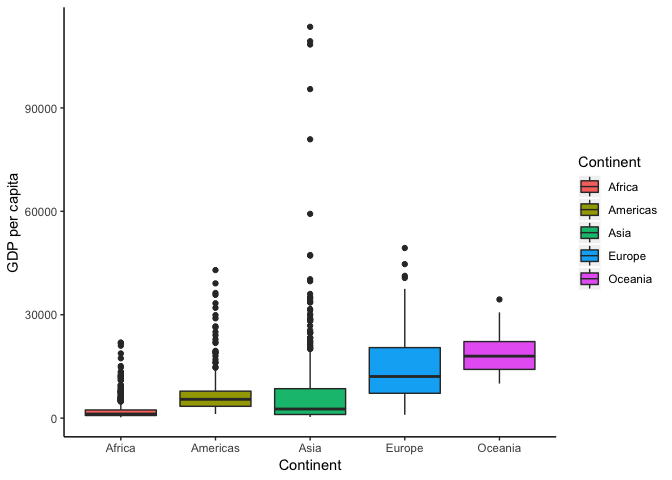
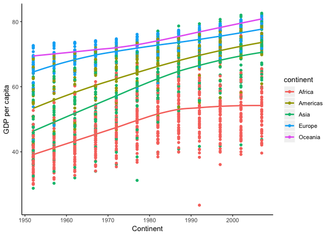

hw03-tsmith93
================
Thomas Smith
2018-09-27

Loading packages
----------------

If you haven't already done so, download both gapminder and tidyverse using `install.packages()`

Next load gapminder, tidyverse and knitr:

``` r
#suppressPackageStartupMessages stops unecessary messages from popping up
suppressPackageStartupMessages(library(tidyverse))
suppressPackageStartupMessages(library(gapminder))
suppressPackageStartupMessages(library(knitr))
```

Problem solving uing dplyr and ggplot2
--------------------------------------

Maximum and minimum of GDP per capita for all continents
========================================================

``` r
gapminder %>% 
  group_by(continent) %>% 
  mutate_each(funs(round(.,2)), gdpPercap) %>% 
  summarize(minimum = min(gdpPercap),
  maximum =max(gdpPercap)) %>% 
  kable(col.names = c("Continent", " Minimum GDP per Capita", "Maximum GDP per Capita"))  
```

    ## `mutate_each()` is deprecated.
    ## Use `mutate_all()`, `mutate_at()` or `mutate_if()` instead.
    ## To map `funs` over a selection of variables, use `mutate_at()`

| Continent |  Minimum GDP per Capita|  Maximum GDP per Capita|
|:----------|-----------------------:|-----------------------:|
| Africa    |                  241.17|                21951.21|
| Americas  |                 1201.64|                42951.65|
| Asia      |                  331.00|               113523.13|
| Europe    |                  973.53|                49357.19|
| Oceania   |                10039.60|                34435.37|

Let's double check to see if these values are what we are looking for:

``` r
gapminder %>% 
  filter(continent == "Asia") %>% 
  arrange(gdpPercap)
```

    ## # A tibble: 396 x 6
    ##    country  continent  year lifeExp       pop gdpPercap
    ##    <fct>    <fct>     <int>   <dbl>     <int>     <dbl>
    ##  1 Myanmar  Asia       1952    36.3  20092996      331 
    ##  2 Myanmar  Asia       1992    59.3  40546538      347 
    ##  3 Myanmar  Asia       1967    49.4  25870271      349 
    ##  4 Myanmar  Asia       1957    41.9  21731844      350 
    ##  5 Myanmar  Asia       1972    53.1  28466390      357 
    ##  6 Cambodia Asia       1952    39.4   4693836      368.
    ##  7 Myanmar  Asia       1977    56.1  31528087      371 
    ##  8 Myanmar  Asia       1987    58.3  38028578      385 
    ##  9 Myanmar  Asia       1962    45.1  23634436      388 
    ## 10 China    Asia       1952    44   556263527      400.
    ## # ... with 386 more rows

``` r
ggplot(gapminder, aes(continent, gdpPercap)) +
  geom_boxplot(aes(fill=continent)) +
  xlab("Continent") +
  ylab("GDP per capita") +
  guides(fill=guide_legend(title="Continent")) +
  theme(panel.grid.major = element_blank(), panel.grid.minor = element_blank(), panel.background = element_blank(),
  axis.line = element_line(colour = "black"))
```



Life Expectancy over year
-------------------------

``` r
gapminder %>% 
ggplot(aes(year, lifeExp)) +
  xlab("Continent") +
  ylab("GDP per capita") +
  geom_point(aes(colour = continent)) +
   geom_smooth(se = FALSE, aes(colour = continent)) +
  theme(panel.grid.major = element_blank(), panel.grid.minor = element_blank(), panel.background = element_blank(),
  axis.line = element_line(colour = "black"))
```

    ## `geom_smooth()` using method = 'loess' and formula 'y ~ x'



``` r
longdata <- gapminder %>% 
  filter(year == "1952" | year == "2007") %>% 
  select(continent, year, lifeExp) %>% 
  group_by(continent, year) %>% 
  summarize(Life = mean(lifeExp))


widedata <- spread(longdata, year, Life)

colnames(widedata) <- c("continent", "first","last")
  

widedata %>% 
  mutate(difference = last - first) %>% 
  mutate_each(funs(round(.,2))) %>% 
  kable(col.names = c("Continent", "Life expectancy in 1952", "Life expectancy in 2007", "Change in life expectancy"))
```

    ## `mutate_each()` is deprecated.
    ## Use `mutate_all()`, `mutate_at()` or `mutate_if()` instead.
    ## To map `funs` over all variables, use `mutate_all()`

| Continent |  Life expectancy in 1952|  Life expectancy in 2007|  Change in life expectancy|
|:----------|------------------------:|------------------------:|--------------------------:|
| Africa    |                    39.14|                    54.81|                      15.67|
| Americas  |                    53.28|                    73.61|                      20.33|
| Asia      |                    46.31|                    70.73|                      24.41|
| Europe    |                    64.41|                    77.65|                      13.24|
| Oceania   |                    69.25|                    80.72|                      11.46|
